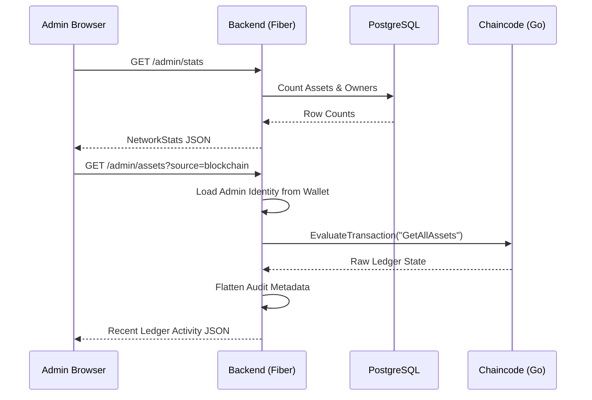
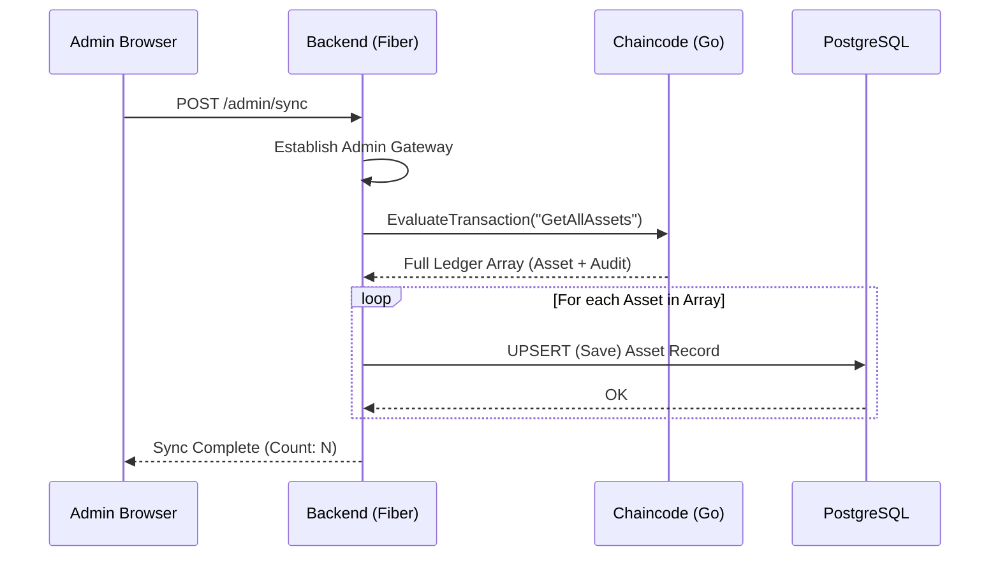
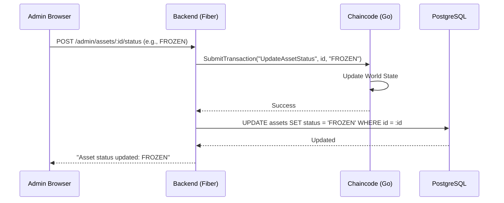

# Application Workflows & Sequence Diagrams

This document outlines the core operational flows between the Frontend, Backend, PostgreSQL Database, and Hyperledger Fabric Ledger.

## 1. Admin Oversight & Real-time Monitoring
This flow occurs when an administrator loads the **Admin Dashboard**. It performs a hybrid lookup of both cached database stats and live blockchain records.



## 2. Ledger-to-Database Synchronization
This flow ensures the off-chain search engine (PostgreSQL) is consistent with the immutable blockchain ledger.



## 3. Asset Lifecycle (Creation & Sync)
When a user creates an asset, it is written to the blockchain first. The database is updated via the asynchronous Event Listener.

```mermaid
sequenceDiagram
    participant User as User Browser
    participant API as Backend (Fiber)
    participant Fabric as Chaincode (Go)
    participant Listener as Event Listener (Go Routine)
    participant DB as PostgreSQL

    User->>API: POST /assets (CreateAsset)
    API->>Fabric: SubmitTransaction("CreateAsset", id, name...)
    Fabric->>Fabric: Commit to Ledger & Emit EVENT
    Fabric-->>API: Success
    API-->>User: "Asset Created"
    
    Note over Fabric, Listener: Asynchronous Event Notification
    
    Fabric-))Listener: ChaincodeEvent (com.own.registry:AssetCreated)
    Listener->>API: Process Event Payload
    Listener->>DB: Save to assets table
    DB-->>Listener: Persisted
```

## 4. Administrative Control (Freeze/Revoke)
How an administrator overrides asset state for governance purposes.


