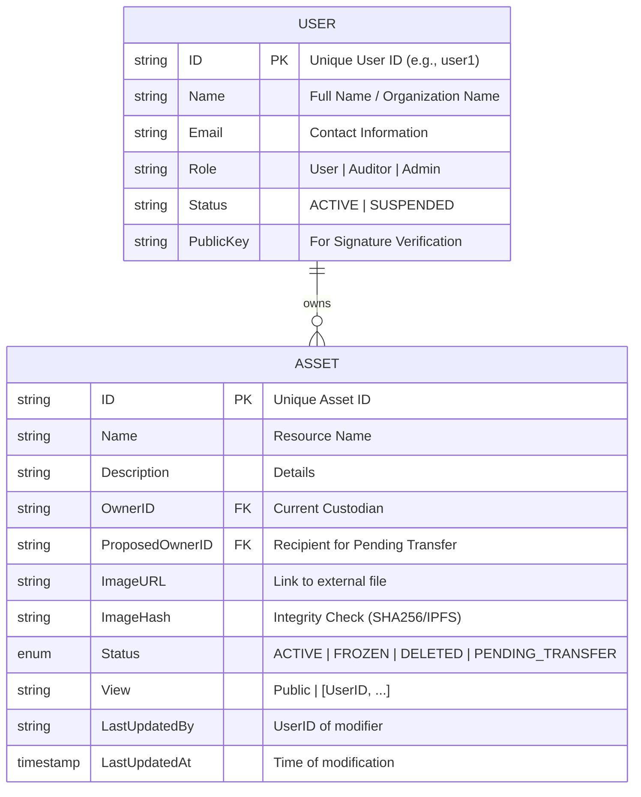

# Ownership Registry Architecture

This document outlines the data model for a **Pure Ownership Registry**. The system focuses strictly on **Identity**, **Possession**, and **Access Control**, tracking who owns what without tracking monetary value.

## 1. Entity Relationship Model (ERD)

The core business logic revolves around validating ownership and access rights.

### Relationship: Custody & Access
A **User** owns an **Asset**. The Asset's visibility is controlled by its `View` setting.



## 2. On-Chain Schema (Hyperledger Fabric)

**Purpose**: The immutable ledger of ownership history.

### Asset Schema
```json
{
  "docType": "asset",
  "ID": "asset101",
  "Name": "Legal Document A",
  "Description": "Notarized contract",
  "OwnerID": "user1",
  "ProposedOwnerID": "",
  "ImageURL": "https://storage.example.com/asset101.jpg",
  "ImageHash": "e3b0c44298fc1c149afbf...",
  "Status": "ACTIVE", 
  "View": "Public",
  "LastUpdatedBy": "user1",
  "LastUpdatedAt": "2023-01-01T12:00:00Z"
}
```

### Enumerations

#### Status
- `ACTIVE`: Asset is valid and can be transferred.
- `PENDING_TRANSFER`: Transfer initiated; waiting for recipient acceptance.
- `FROZEN`: Asset is locked (e.g., under investigation). No transfers allowed.
- `DELETED`: Asset is burned/revoked. No further actions allowed.

#### View (Access Control)
- `Public`: Visible to everyone in the system.
- `[user1, user2]`: RESTRICTED. Visible only to the Owner + listed participants.

## 3. Off-Chain Schema (PostgreSQL)

**Purpose**: High-speed filtering by Owner or Status.

**Table: `assets`**
| Column | Type | Notes |
| :--- | :--- | :--- |
| `id` | VARCHAR(64) | Primary Key |
| `name` | VARCHAR(255) | |
| `description` | TEXT | |
| `owner_id` | VARCHAR(64) | Indexed for "My Assets" queries |
| `proposed_owner_id` | VARCHAR(64) | For pending transfers |
| `image_url` | TEXT | External link |
| `image_hash` | VARCHAR(128) | For integrity verification |
| `status` | VARCHAR(20) | Enum: ACTIVE, PENDING_TRANSFER, FROZEN, DELETED |
| `view_policy` | TEXT | JSON string or Array of allowed IDs |
| `last_updated_by` | VARCHAR(64) | UserID who performed action |
| `last_updated_at` | TIMESTAMP | ISO8601 Timestamp |
| `updated_at` | TIMESTAMP | DB Sync Audit trail |

## 4. Digital Media Strategy (IPFS)

**Storage**: All media assets MUST be stored on **IPFS** (InterPlanetary File System) to ensure decentralized availability and immutability.

1.  **Upload**: User uploads file to Backend.
2.  **Pin**: Backend creates an IPFS node or uses a pinning service (e.g., Pinata) to **pin** the file.
3.  **CID**: IPFS returns a Content Identifier (CID) (e.g., `QmX...`).
4.  **Transact**: The CID is stored On-Chain as the `ImageHash` (serving as both Link and Hash).

## 5. Asset History (Provenance)

Hyperledger Fabric automatically maintains a history of all key-value updates.

**Tracking**:
- Every time `OwnerID` or `Status` changes, a new block is written.
- We expose a `GetAssetHistory` chaincode function to retrieve the full timeline.

**History Record Structure**:
```json
[
  { 
    "TxId": "tx1", 
    "Timestamp": "2023-01-01T10:00:00Z", 
    "ActorID": "user1", 
    "ActionType": "CREATE",
    "Value": { "OwnerID": "user1", "Status": "ACTIVE", ... } 
  },
  { 
    "TxId": "tx2", 
    "Timestamp": "2023-02-01T14:30:00Z", 
    "ActorID": "user1", 
    "ActionType": "TRANSFER_PROPOSE",
    "Value": { "OwnerID": "user1", "Status": "PENDING_TRANSFER", "ProposedOwnerID": "user2", ... } 
  },
  { 
    "TxId": "tx3", 
    "Timestamp": "2023-02-01T15:00:00Z", 
    "ActorID": "user2", 
    "ActionType": "TRANSFER_ACCEPT",
    "Value": { "OwnerID": "user2", "Status": "ACTIVE", ... } 
  }
]
```

## 7. User Data Privacy Strategy

**Critical Rule**: User Profile Data (`Name`, `Email`, `Phone`) is **NEVER** stored On-Chain.

### Why?
1.  **GDPR/Privacy**: Blockchains are immutable; you cannot "delete" personal data, violating privacy laws.
2.  **Architecture**: Fabric uses **MSP (Certificates)** for Identity, not a database table.

### Implementation
- **Identity (On-Chain)**: The ledger only sees the opaque `UserID` (Subject Common Name from x509 Cert) inside transactions.
- **Profile (Off-Chain)**: The `users` table in PostgreSQL stores `Name`, `Email`, `Role`.
- **Mapping**: The Application Backend maps the `Ctx.GetCreator()` UserID to the Off-Chain database to display user names.

## 8. Workflows

### A. Transfer Ownership (Two-Factor Transaction)

Transactions require mutual agreement. The Owner **proposes** a transfer, and the Recipient must **accept** it.

#### Phase 1: Proposal (Owner)
1.  **Check**: Is Asset `ACTIVE`?
2.  **Check**: Is Requester == `OwnerID`?
3.  **Action**: Set `Status` = `PENDING_TRANSFER`.
4.  **Action**: Set separate `ProposedOwnerID` field to Recipient.
5.  **Event**: Emit `TransferProposed` (Recipient notified).

#### Phase 2: Acceptance (Recipient)
1.  **Check**: Is Asset `PENDING_TRANSFER`?
2.  **Check**: Is Requester == `ProposedOwnerID`?
3.  **Action**: Update `OwnerID` to Requester.
4.  **Action**: Set `Status` = `ACTIVE`.
5.  **Action**: Clear `ProposedOwnerID`.
6.  **Log**: Ownership change finalized.

### B. Freezing (Governance)
1.  **Check**: Is Requester == Admin?
2.  **Action**: Set `Status` = `FROZEN`.
3.  **Result**: Transfers are blocked until Unfrozen.
