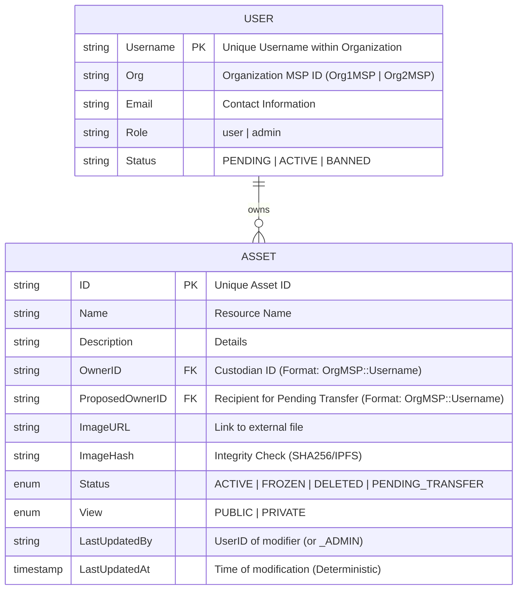

# Ownership Registry Architecture

This document outlines the data model for a **Pure Ownership Registry**. The system focuses strictly on **Identity**, **Possession**, and **Access Control**, tracking who owns what without tracking monetary value.

## 1. Entity Relationship Model (ERD)

The core business logic revolves around validating ownership and access rights.

### Relationship: Custody & Access
A **User** owns an **Asset**. The Asset's visibility is controlled by its `View` setting.



## 2. On-Chain Schema (Hyperledger Fabric)

**Purpose**: The immutable ledger of ownership history.

### Asset Schema
```json
{
  "docType": "asset",
  "ID": "asset101",
  "Name": "Legal Document A",
  "Description": "Notarized contract",
  "OwnerID": "Org1MSP::charlie",
  "ProposedOwnerID": "",
  "ImageURL": "https://storage.example.com/asset101.jpg",
  "ImageHash": "e3b0c44298fc1c149afbf...",
  "Status": "ACTIVE", 
  "View": "PUBLIC",
  "LastUpdatedBy": "Org1MSP::charlie",
  "LastUpdatedAt": "2023-01-01T12:00:00Z"
}
```

### Enumerations

#### Status
- `ACTIVE`: Asset is valid and can be transferred.
- `PENDING_TRANSFER`: Transfer initiated; waiting for recipient acceptance.
- `FROZEN`: Asset is locked (e.g., under investigation). No transfers allowed.
- `DELETED`: Asset is burned/revoked. No further actions allowed.

#### View (Access Control)
- `PUBLIC`: Publicly visible to all authenticated users in the Discovery Gallery.
- `PRIVATE`: Restricted access. Visible ONLY to the Asset Owner and System Administrators.

## 3. Off-Chain Schema (PostgreSQL)

**Purpose**: High-speed filtering by Owner or Status.

**Table: `users`**
| Column | Type | Notes |
| :--- | :--- | :--- |
| `id` | SERIAL | Primary Key |
| `username` | VARCHAR(64) | Unique Index (with Org) |
| `org` | VARCHAR(64) | Org1MSP or Org2MSP |
| `email` | VARCHAR(255) | |
| `role` | VARCHAR(20) | user, admin |
| `status` | VARCHAR(20) | PENDING, ACTIVE, BANNED |

**Identity & Wallet Storage**
To support multiple organizations without name collisions, the backend isolates identities in a hierarchical wallet structure:
`./backend/wallet/<MSPID>/<username>/`

Each folder contains:
- `cert.pem`: The user's X.509 certificate.
- `key.pem`: The user's private key.
- `mspid`: A text file containing the organization identifier.

**Table: `assets`**
| Column | Type | Notes |
| :--- | :--- | :--- |
| `id` | VARCHAR(64) | Primary Key |
| `name` | VARCHAR(255) | |
| `description` | TEXT | |
| `owner_id` | VARCHAR(128) | Indexed |
| `proposed_owner_id` | VARCHAR(128) | |
| `image_url` | TEXT | |
| `image_hash` | VARCHAR(128) | |
| `status` | VARCHAR(20) | |
| `view_policy` | TEXT | |
| `last_updated_by` | VARCHAR(128) | |
| `last_updated_at` | TIMESTAMP | |
| `updated_at` | TIMESTAMP | |

## 4. Digital Media Strategy (IPFS)

**Storage**: All media assets MUST be stored on **IPFS** (InterPlanetary File System) to ensure decentralized availability and immutability.

1.  **Upload**: User uploads file to Backend.
2.  **Pin**: Backend creates an IPFS node or uses a pinning service (e.g., Pinata) to **pin** the file.
3.  **CID**: IPFS returns a Content Identifier (CID) (e.g., `QmX...`).
4.  **Transact**: The CID is stored On-Chain as the `ImageHash` (serving as both Link and Hash).

## 5. Asset History (Provenance)

Hyperledger Fabric automatically maintains a history of all key-value updates.

**Tracking**:
- Every time `OwnerID` or `Status` changes, a new block is written.
- We expose a `GetAssetHistory` chaincode function to retrieve the full timeline.

**History Record Structure**:
```json
[
  { 
    "TxId": "tx1", 
    "Timestamp": "2023-01-01T10:00:00Z", 
    "ActorID": "user1", 
    "ActionType": "CREATE",
    "Value": { "OwnerID": "user1", "Status": "ACTIVE", ... } 
  },
  { 
    "TxId": "tx2", 
    "Timestamp": "2023-02-01T14:30:00Z", 
    "ActorID": "user1", 
    "ActionType": "TRANSFER_PROPOSE",
    "Value": { "OwnerID": "user1", "Status": "PENDING_TRANSFER", "ProposedOwnerID": "user2", ... } 
  },
  { 
    "TxId": "tx3", 
    "Timestamp": "2023-02-01T15:00:00Z", 
    "ActorID": "user2", 
    "ActionType": "TRANSFER_ACCEPT",
    "Value": { "OwnerID": "user2", "Status": "ACTIVE", ... } 
  }
]
```

## 7. User Data Privacy Strategy

**Critical Rule**: User Profile Data (`Name`, `Email`, `Phone`) is **NEVER** stored On-Chain.

### Why?
1.  **GDPR/Privacy**: Blockchains are immutable; you cannot "delete" personal data, violating privacy laws.
2.  **Architecture**: Fabric uses **MSP (Certificates)** for Identity, not a database table.

### Implementation
- **Identity (On-Chain)**: The ledger uses a globally unique identifier in the format **`OrgMSP::Username`**.
  - **Generation**: The chaincode extracts the `MSPID` and `hf.EnrollmentID` attribute from the caller's certificate.
  - **Reliability**: If `hf.EnrollmentID` is unavailable, it falls back to the certificate's **Common Name (CN)**.
- **Profile (Off-Chain)**: The `User` model in PostgreSQL stores `Username`, `Org`, `Email`, `Role`.
- **Mapping**: The Application Backend maps the current logged-in user to their organization via the PostgreSQL database to automate the construction of the full `OrgMSP::Username` identifier for blockchain transactions (e.g., during transfers).
- **Synchronization**: A manual **Sync Ledger** mechanism is provided via the Admin Console to backfill the PostgreSQL database from the Blockchain World State. This ensures that even if events are missed, the off-chain cache can be refreshed to maintain high-performance administrative queries while the Ledger remains the single source of truth.
- **Dual-Source Dashboard**: The Admin Dashboard utilizes a hybrid data strategy, fetching high-level stats from PostgreSQL while displaying a real-time feed of recent ledger activity directly from the Chaincode (`GetAllAssets`) for immediate oversight of new transactions.

### 9. Privacy Enforcement (OPA & Backend API)

The system uses **Open Policy Agent (OPA)** to enforce strict visibility filtering and authorization, ensuring data isolation between users.

1.  **Centralized Policy (OPA)**: All high-level authorization decisions (e.g., "Can this user access /admin/stats?") are delegated to an OPA sidecar. Policies are written in **Rego** for maximum flexibility.
2.  **Administrative Access**: Users with the `admin` role are granted broad access via policies, allowing them to retrieve all assets regardless of their `View` setting.
3.  **Standard User Retrieval**: 
    - **Authorization**: OPA checks if the user has general access to the requested endpoint.
    - **Listing Filtering**: The backend filters database queries to return only records where `View = 'PUBLIC'` OR `OwnerID = currentUser`.
    - **Detail Access**: Performs an runtime check. If an asset is `PRIVATE` and not owned by the requester, a `403 Forbidden` is returned.
4.  **UI Isolation**: The frontend utilizes two distinct detail paths:
    - `/gallery/:id`: Read-only discovery view powered by the database.
    - `/assets/:id`: Management console for owners/admins.

## 8. Workflows

### A. Transfer Ownership (Two-Factor Transaction)

Transactions require mutual agreement. The Owner **proposes** a transfer, and the Recipient must **accept** it.

#### Phase 1: Proposal (Owner)
1.  **Check**: Is Asset `ACTIVE`?
2.  **Check**: Is Requester == `OwnerID`?
3.  **Action**: Set `Status` = `PENDING_TRANSFER`.
4.  **Action**: Set separate `ProposedOwnerID` field to Recipient.
5.  **Event**: Emit `TransferProposed` (Recipient notified).

#### Phase 2: Acceptance (Recipient)
1.  **Check**: Is Asset `PENDING_TRANSFER`?
2.  **Check**: Is Requester == `ProposedOwnerID`?
3.  **Action**: Update `OwnerID` to Requester.
4.  **Action**: Set `Status` = `ACTIVE`.
5.  **Action**: Clear `ProposedOwnerID`.
6.  **Log**: Ownership change finalized.

### B. Governance Override (Freeze/Revoke)
1.  **Check**: Does Requester have `admin` attribute? (Or is an Organization Admin?)
2.  **Action**: Admin calls `UpdateAssetStatus(ID, Status)`.
3.  **Update**: 
    - `Status` -> `FROZEN` / `DELETED` / `ACTIVE`.
    - `LastUpdatedBy` -> `RequesterID + "_ADMIN"`.
4.  **Result**: 
    - `FROZEN`: Transfers blocked.
    - `DELETED`: Asset effectively burned.
    - `ACTIVE`: Asset restored to normal circulation.
